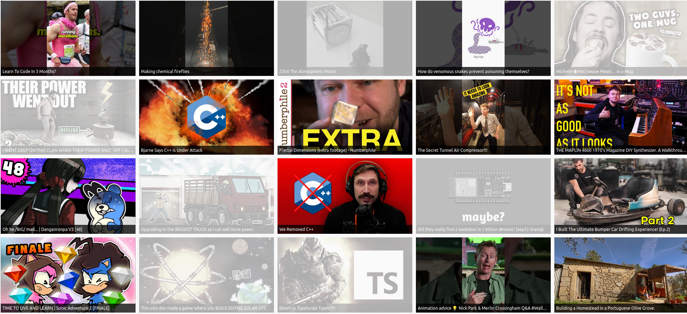

# YouTube Sub List

A simple web app which aggregates videos from YouTube channels via RSS, no account needed.




## Run

The easiest way to get started is to run PHPs built-in webserver. PHP 8.4 or later is required.

```
PHP_CLI_SERVER_WORKERS=$(nproc) php -S localhost:8008 -t public
```

There is also a Docker container:

```
docker build -t youtube-subscriptions .
docker run \
    --name youtube-subscriptions \
    -e PHP_CLI_SERVER_WORKERS=$(nproc) \
    -d \
    -p 8008:80 \
    -v $PWD/channels.txt:/var/www/html/channels.txt \
    -v $PWD/videos.json:/var/www/html/videos.json \
    youtube-subscriptions
```


# Channel Subscriptions 

The list of subscribed channels is defined in a `channels.txt` file in the root directory. It should look like this:

```text
https://www.youtube.com/@username0
https://www.youtube.com/@username1
https://www.youtube.com/@username2
```

To mark a channel as 'featured' prepend a * to the start of the line:

```text
https://www.youtube.com/@username0
*https://www.youtube.com/@favourite
https://www.youtube.com/@username2
```


# Limitations

The YouTube RSS feeds only include the 15 latest videos. The app will persist all videos that are fetched into
`videos.json` but this means that some might get missed if a channel releases more than 15 videos between refreshes.

To help with this the page will auto-refresh once per hour so long as the tab is open and a video isn't currently
playing.
